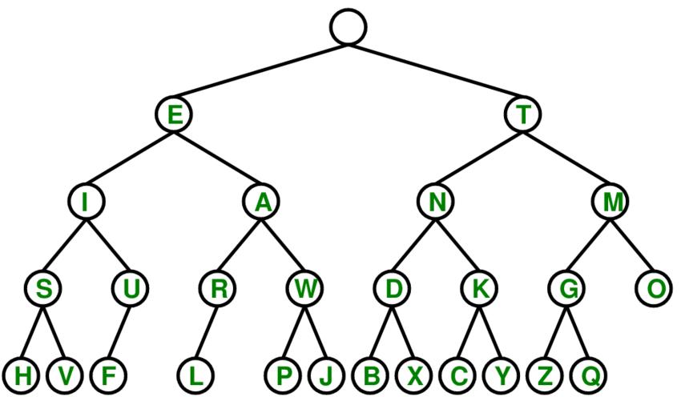

# ESP 32 Morse Code Translator
Cameron Kasprzak | cameron-kasprzak@outlook.com

## Motivation
I began this project to gain familiarity with programming in an embedded environment and to keep developing my programming skills after graduation.

## How It Works

Morse code can be represented as a binary tree that can be navigated with dots representing Left Branches and Dashes representing Right Branches. I will refer to Dots and Dashes rather than Left or Right traversals henceforth. The ESP32 is programmed to interpret short and long presses and read a this navigate this binary tree based on user input.

### Data Structures
#### Binary Tree

As stated above, morse code can be read in a binary tree, so the alphabet needed to be formatted into a binary tree to be traversed. To save memory and time allocating, I used a simple array of characters. This can be used as a binary tree using the following scheme. 
	Array position _i_ can access its "left child" by navigating to the position located at ( (2 * _i_) + 1 )
	Array position _i_ can access its "right child" by navigating to the position located at ( (2 * _i_) + 2 )

### Functions
#### Loop
	Each loop creates sets the  _position_ variable to 0. This position will represent our position in the binary tree taht represents our morse code alphabet, seen above.
	The main loop running on the ESP32 begins a nested while loop that will run for a pre-determined _LETTER_WINDOW_ amount of iterations. If an input is given on the button, the time it is pressed is noted and a while loop begins to stall the program until the button is released, upon which the time is noted again. The length of time the button was held down is evaluated to determine if it was held for _DASH_TIME_ ms. If it was held for less than _DASH_TIME_, it was a DOT, and _position_ is set to ( (2 * _position_) + 1 ). If the the button was held for sufficient amount of time, we calculate a DASH and move position to ( (2 * _position_) + 2). Either way, the iterations counter is reset to 0 to allow for another DASH or DOT. 
	Once no input is received for long enough, the inner loop exits, and the _position_'th letter in our binary tree array is displayed. Then the loop repeats and waits for another input.
